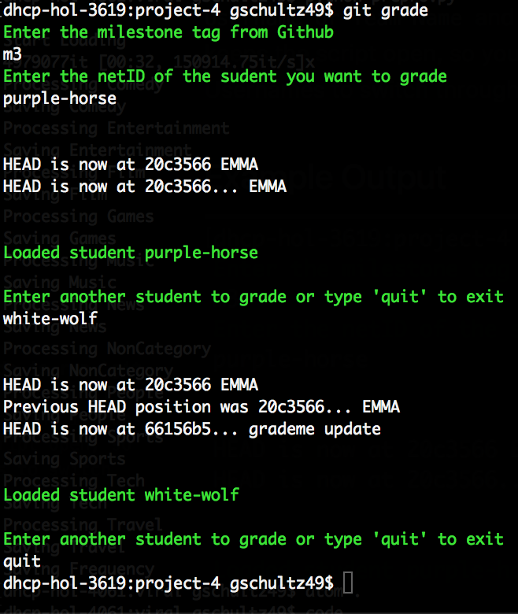

# Git Grade
## For CS 2300

### This script reduces the number of inputs you need to grade students' projects

Typically, you have to enter

```
$ git reset --hard

$ git clean -dfx

$ git fetch <Github Username or Team Name>

$ git checkout remotes/<Github Username or Team Name>/submission-<milestone or final>
```

Once the script is installed, all you have to do is run `git grade` and enter the milestone or final (`m1`,`m2`,`final`, `etc...`) and the `Github Username or Team Name` and it runs the above steps automatically! It keeps the script open, so you can just keep entering the Github Usernames to switch through your students. Type `quit` to exit the application


## Installation

### macOS
You'll simply need to copy the `git-grade` file into your `/usr/local/bin` and restart your terminal

### Windows
???

### Example Output


